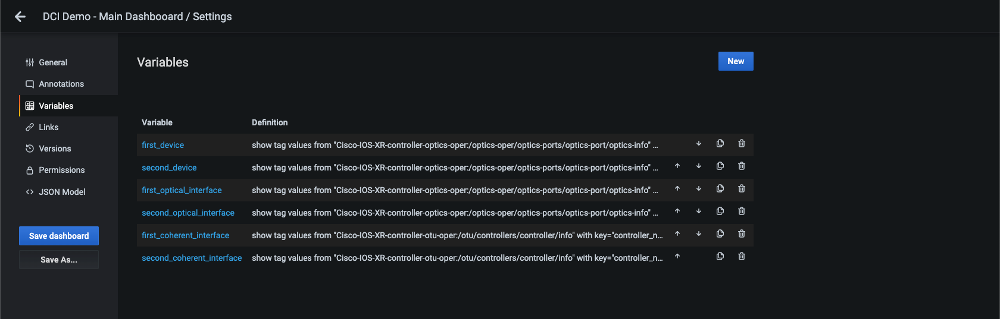

# Model Driven Telemetry Platform for Monitoring NCS1k

A sample platform for collecting telemetry data from NCS1k and showing it on Grafana dashboard.
Setup comprises a few services running in Docker:
  * Telegraf for telemetry collection from devices
  * InfluxDB
  * Grafana

## Installation
1. Clone the repo on your server
2. Update _.env_ and _telegraf-var.env_ to reflect your network configuration
3. Start containers `docker-compose up`
4. Log in to Grafana (default credentials admin/admin) and update variable regex configuration for a dashboard to reflect your device configuration (hostname, optical interface and coherent intereface number)
  * Go to *Dashboard settings* (small gear in right upper corner)
  * Click on *Variables* option
  
  * Click on *Variable name* and change *Regex* option to match your hostname and interface name
  
  

Final dashboard should look like this:
 